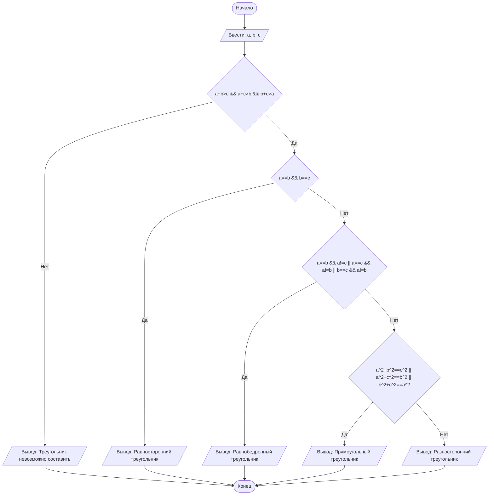

## Отчет по лабораторной работе № 1

#### № группы: `ПМ-2502`

#### Выполнил: `Мануйло Данил Евгеньевич`

#### Вариант: `10`

### Cодержание:

- [Постановка задачи](#1-постановка-задачи)
- [Входные и выходные данные](#2-входные-и-выходные-данные)
- [Математическая модель](#3-математическая-модель)
- [Выбор структуры данных](#4-выбор-структуры-данных)
- [Алгоритм](#5-алгоритм)
- [Программа](#6-программа)
- [Анализ правильности решения](#7-анализ-правильности-решения)

### 1. Постановка задачи

> Программа получает на вход 3 натуральных числа A, B, C. Нужно проверить, возможно ли из них составить треугольник, и если
> да, то определить тип треугольника: равносторонний, равнобедренный, разносторонний или прямоугольный. Выводить необходимо только один тип.

Данную задачу можно разделить на 2 подзадачи: проверка сущетвования треугольника и определение его типа при условии существования.

- Для 1 подзадачи нужно рассмотреть 2 случая:
    1. `A + B > C && B + C > A && A + C > B` треугольник существует
    2. `A + B <= C || A + C <=B || B + C <=A` (отрицание 1 случая)
- Для 2 подзадачи необходимо рассмотреть 4 случая:
    1. `A == B && B == C` равносторонний треугольник
    2. `A == B && A!= C || B == C && B!= A || A == C && A != B` равнобедренный треугольник
    3. `A != B && B != C && A != C` разносторонний треугольник
    4. `A*A + B*B == C*C || B*B + C*C == A || A*A + C*C == B` прямоугольный треугольник

Всего надо рассмотреть `1*4 + 1 = 5` случаев.

### 2. Входные и выходные данные

#### Данные на вход

На вход программа должна получать 3 натуральных числа.

| Переменная  |     Тип     | min значение    |    max значение    |
|-------------|-------------|-----------------|--------------------|
| A (Число 1) | Целое число |        1        | 2<sup>31</sup> - 1 |
| B (Число 2) | Целое число |        1        | 2<sup>31</sup> - 1 |
| C (Число 3) | Целое число |        1        | 2<sup>31</sup> - 1 |

#### Данные на выход

Программа выдает одну из следующих фраз:
- Треугольник невозможно составить
- Можно составить равносторонний треугольник
- Можно составить равнобедренный треугольник
- Можно составить разносторонний треугольник
- Можно составить прямоугольный треугольник

### 3. Математическая модель

1. `A + B > C && B + C > A && A + C > B` условие существования любого треугольника - сумма двух любых сторон должна превосходить третью.
2. `A == B && B == C` равносторонний треугольник
3. `A == B && A != C || A == C && A != B || B == C && A !=B` равнобедренный треугольник
4. `A*A + B*B == C*C || B*B + C*C == A || A*A + C*C == B` прямоугольный треугольник
5. `A != B && B != C && A != C` разносторонний треугольник

### 4. Выбор структуры данных

Программа получает 3 натуральных числа, поэтому для хранения данных достаточно выделить три переменные `a, b и c` типа данных `int`.

|             | название переменной | Тип (в Java) | 
|-------------|---------------------|--------------|
| A (Число 1) | `a`                 |    `int`     |
| B (Число 2) | `b`                 |    `int`     | 
| C (Число 3) | `c`                 |    `int`     | 

Для вывода результата необязательно его хранить в отдельной переменной.

### 5. Алгоритм

#### Алгоритм выполнения программы:

1. **Ввод данных:**  
   Программа считывает три натуральных числа, обозначенных как `a`, `b` и `c`.

2. **Существование треугольника:**  
   Программа проверяет данные на условие существование треугольника (сумма двух любых сторон должна превосходить третью) для значений `a`, `b` и `c`. Если выполняется условие существования треугольника, то программа переходит к шагу определения типа треугольника. Если же условие не выполняется, то программа выводит соответствующую фразу и завершает работу.

3. **Проверка типа треугольника, если таковой существует:**
    - Если переменные `a, b, c` совпадают по значениям, то треугольник является равносторонний, о чем программа сообщает пользователю и завершает свою работу. Иначе программа продолжает рассматривать следующий случай.
    - Если `a==b && a!=c || a==c && a!=b || b==c && a!=b`, то треугольник является равнобедренным, о чем программа сообщает пользователю и завершает свою работу. Иначе программа продолжает рассматривать следующий случай.
    - Если `a*a + b*b == c*c || a*a + c*c == b*b || c*c + b*b == a*a`, то треугольник является прямоугольным, о чем программа сообщает пользователю и завершает свою работу.
    - Если не выполнилось ни одно из предыдущих условий (кроме условия существования), то треугольник является разносторонним, о чем программа сообщает пользователю и завершает свою работу.

4. **Вывод результата:**  
   На экран выводится фраза о том, что треугольник не существует либо тип получаемого треугольника.

#### Блок-схема



### 6. Программа

```java
import java.util.Scanner;

public class Main {
    public static void main(String[] args) {
        Scanner scan = new Scanner(System.in);
        int a = scan.nextInt(), b = scan.nextInt(), c = scan.nextInt(); // ввод длин отрезков
        if (a+b>c && a+c>b && b+c>a){ // условия существования треугольника
            if (a==b && b==c){ //условие равностороннего треугольника
                System.out.println("Можно составить равносторонний треугольник");
            } else {
                if (a == b && a!=c || a == c && a!=b || c == b && a!=c) { //условие для равнобедренного треугольника
                    System.out.println("Можно составить равнобедренный треугольник");
                } else {
                    if (a*a + b*b == c*c || a*a + c*c == b*b || c*c + b*b == a*a){//проверка на прямоугольность
                        System.out.println("Можно составить прямоугольный треугольник");
                    } else {
                        System.out.println("Можно составить разносторонний треугольник"); //если не выполнилось условие существования
                    }
                }
            }
        } else {
            System.out.println("Треугольник невозможно составить");
        }

    }
}

```

### 7. Анализ правильности решения

Программа работает корректно на всем множестве решений с учетом ограничений.

1. Тест на `a = b = c`:

    - **Input**:
        ```
        5 5 5
        ```

    - **Output**:
        ```
        Можно составить равносторонний треугольник
        ```

2. Тест на `a == b  && a!=c || a == c && a!=b || c == b && a!=c`:

    - **Input**:
        ```
        7 7 10
        ```

    - **Output**:
        ```
        Можно составить равнобедренный треугольник
        ```

3. Тест на `a^2 + b^2 == c^2 || a^2 + c^2 == b^2 || b^2 + c^2 == a^2`:

    - **Input**:
        ```
        4 3 5
        ```

    - **Output**:
        ```
        Можно составить прямоугольный треугольник
        ```

4. Тест на `a!=b && b!=c && a!=c`:

    - **Input**:
        ```
        5 7 9
        ```

    - **Output**:
        ```
        Можно составить разносторонний треугольник
        ```
5. Тест на `a+b<=c || a+c<=b || b+c<=a`:

    - **Input**:
        ```
        13 7 25
        ```

    - **Output**:
        ```
        Треугольник невозможно составить
        ```
